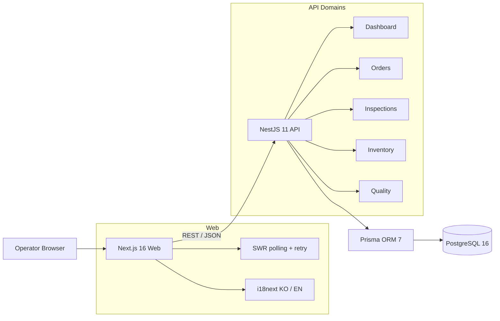
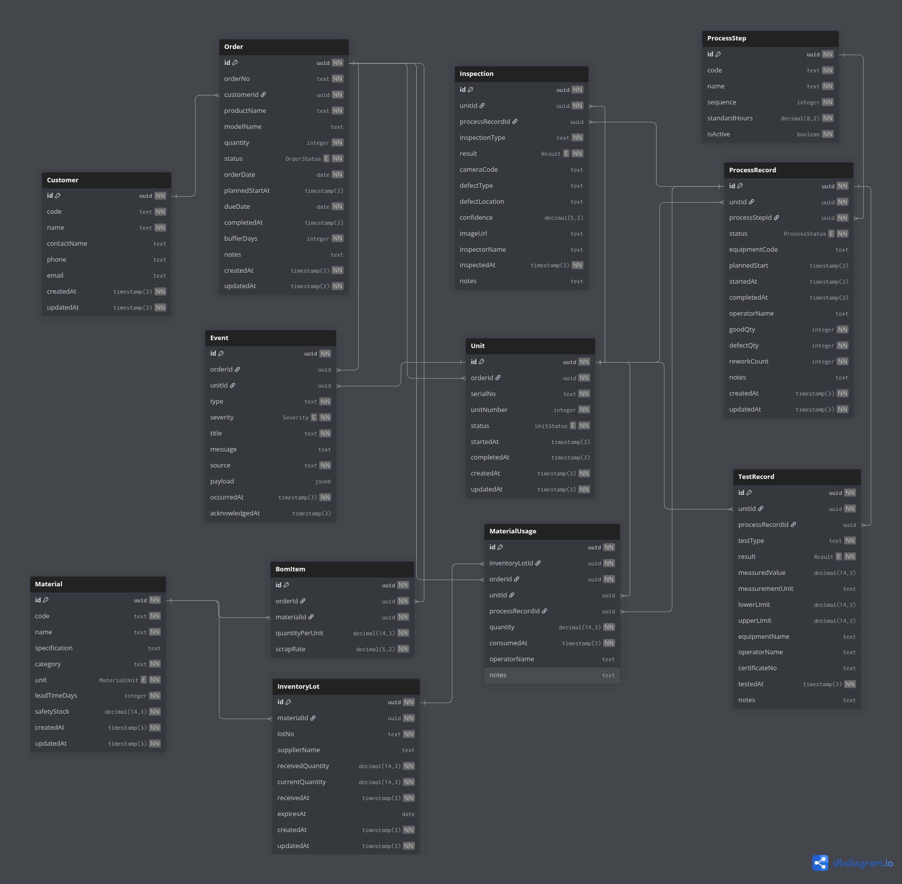

# DNS Smart Factory MES

수배전반 제조 현장의 수주, 공정, AI 검사, 자재 재고, 품질 이력을 하나의 운영 화면으로 연결한 스마트팩토리 MES 데모입니다.

이 프로젝트는 단순 모니터링 화면이 아니라 **납기 위험과 자재 부족을 사전에 계산하고, 호기 단위 품질 이력을 추적하는 운영형 MVP**를 목표로 합니다.

## 데모 링크

- Web UI: [http://3.35.241.187](http://3.35.241.187)
- Swagger API: [http://3.35.241.187/api/docs](http://3.35.241.187/api/docs)
- Health check: [http://3.35.241.187/api/health](http://3.35.241.187/api/health)

## 핵심 기능

| 모듈        | 주요 기능                                                               |
| ----------- | ----------------------------------------------------------------------- |
| 통합 관제   | 금일 실적, 진행 호기, 납기준수율, 재작업, 설비 가동률 KPI와 공정별 현황 |
| 수주·공정   | 호기별 진척률, 현재 공정, 잔여 표준공수 기반 납기 위험 자동 판정        |
| AI 배선검사 | 검사 대상 선택, AI 검사 시뮬레이션, 결과 저장 및 호기별 검사 이력 조회  |
| 자재·재고   | BOM과 확정 수주를 반영한 2주 소요량, 부족 수량, 발주 필요일 계산        |
| 시험·품질   | 절연저항·내전압·동작시험 결과와 자재 LOT·생산·검사 이력 통합 추적       |
| 다국어      | 한국어/영어 전환, locale별 날짜·숫자·복수형 처리, 선택 언어 저장        |

## 시스템 구성



## ERD

수주부터 호기, 공정, 자재 LOT, 검사, 시험까지 하나의 흐름으로 추적할 수 있도록 관계형 데이터 모델로 설계했습니다.



## 기술 스택

- **Frontend:** Next.js 16, React 19, TypeScript, SWR, i18next, CSS Modules
- **Backend:** NestJS 11, TypeScript, Swagger
- **Database:** PostgreSQL 16, Prisma ORM 7, Prisma driver adapter
- **Workspace:** npm workspaces monorepo
- **Local infrastructure:** Docker Compose

## 주요 설계 결정

### PostgreSQL 선택 이유

MES 데이터는 수주, 호기, 공정, BOM, 자재 LOT, 검사, 시험 결과가 서로 강하게 연결되어 있으며 데이터 간 정합성과 추적성이 중요합니다. PostgreSQL은 다음 이유로 선택했습니다.

- 외래 키, unique constraint, transaction을 이용해 생산 데이터의 정합성을 보장할 수 있습니다.
- 수주별 진척률, 공정 실적, 재고 소요량, 품질 이력처럼 여러 테이블을 결합하는 집계 쿼리에 적합합니다.
- 날짜, 소수점 수량, enum, JSONB 등 MES에서 필요한 데이터 타입을 안정적으로 지원합니다.
- Docker 환경에서 재현하기 쉽고 Prisma ORM과의 호환성 및 운영 안정성이 좋습니다.

Prisma schema는 도메인별 파일로 분리해 가독성을 높였고, migration과 deterministic seed를 통해 동일한 개발·검증 환경을 다시 만들 수 있도록 구성했습니다.

### 애플리케이션 아키텍처

- Next.js Web, NestJS API, Prisma/PostgreSQL을 npm workspaces 기반 monorepo로 구성했습니다.
- API는 Dashboard, Orders, Inspections, Inventory, Quality 도메인 모듈로 분리해 각 업무 규칙의 책임을 명확히 했습니다.
- 납기 위험, 2주 자재 소요량, 부족 수량, 발주 필요일, KPI 집계는 UI가 아니라 서버에서 계산합니다. 따라서 다른 클라이언트가 추가되어도 동일한 규칙을 재사용할 수 있습니다.
- 수주번호와 호기 ID를 중심으로 자재 LOT, 공정 실적, AI 검사, 시험 결과를 연결해 end-to-end traceability를 구현했습니다.
- 과제 범위와 복잡도를 고려해 REST API와 SWR polling을 사용했습니다. WebSocket은 현재 구현하지 않았으며, 실제 운영 환경에서 긴급 알림이나 설비 상태를 즉시 전달해야 할 때 확장할 수 있습니다.
- Frontend는 feature component와 shared UI를 분리하고, API type, formatter, translation resource를 별도 관리해 화면 컴포넌트의 책임을 줄였습니다.

## 프로젝트 구조

```text
dns_smart_factory/
├── apps/
│   ├── api/                  # NestJS REST API
│   │   └── src/modules/      # Domain modules
│   └── web/                  # Next.js operations UI
│       ├── public/locales/   # ko/en translation resources
│       └── src/components/   # Feature and shared UI components
├── packages/
│   └── db/                   # Prisma schema, migrations, seed, shared client
├── docker-compose.yml        # PostgreSQL 16
├── docker-compose.prod.yml   # Production Web, API, migration, PostgreSQL
├── Dockerfile.api            # NestJS runtime and database tools images
├── Dockerfile.web            # Next.js standalone runtime image
└── package.json              # Workspace commands
```

## 실행 방법

### 요구 환경

- Node.js 20 이상
- npm 10 이상
- Docker 및 Docker Compose

### 1. 의존성 설치

```bash
npm install
```

### 2. 환경 변수 준비

```bash
cp .env.example .env
cp apps/api/.env.example apps/api/.env
cp apps/web/.env.example apps/web/.env
cp packages/db/.env.example packages/db/.env
```

기본 설정은 로컬 PostgreSQL `localhost:5432`, API `localhost:3000`, Web `localhost:3001`을 사용합니다.

### 3. 데이터베이스 실행 및 초기화

```bash
docker compose up -d db
npm run db:generate
npm run db:deploy
npm run db:seed
```

### 4. API와 Web 실행

각 명령을 별도 터미널에서 실행합니다.

```bash
npm run dev:api
```

```bash
npm run dev:web
```

### 접속 주소

- Web UI: [http://localhost:3001](http://localhost:3001)
- REST API: [http://localhost:3000/api](http://localhost:3000/api)
- Swagger: [http://localhost:3000/api/docs](http://localhost:3000/api/docs)
- Health check: [http://localhost:3000/api/health](http://localhost:3000/api/health)

## Production 배포

Production 구성은 Next.js standalone Web, NestJS API, PostgreSQL, Prisma migration을 각각 독립 container로 실행합니다. API는 DB 연결 health check를 통과한 뒤에만 Web을 시작하며, migration이 실패하면 API가 시작되지 않습니다.

현재 데모는 AWS EC2 Ubuntu 서버에 Docker Compose로 배포했으며, Nginx가 Web과 `/api` 요청을 각각 Next.js와 NestJS container로 reverse proxy합니다. PostgreSQL은 외부에 공개하지 않고 Docker network 내부에서만 접근하도록 구성했습니다.

```bash
cp deploy/.env.example deploy/.env
# deploy/.env의 비밀번호와 공개 URL을 실제 값으로 변경
npm run deploy:up

# 데모 데이터가 필요한 최초 1회만 실행
npm run deploy:seed
```

`NEXT_PUBLIC_API_URL`은 Web image build 시점에 포함되므로 API 공개 주소가 바뀌면 Web image를 다시 build해야 합니다. 운영 서버에서는 TLS reverse proxy 또는 hosting provider의 HTTPS endpoint를 Web/API 앞에 배치하고 `ENABLE_SWAGGER=false`를 권장합니다.

환경 변수, 외부 DB 사용법, 검증 및 rollback 체크리스트는 [DEPLOYMENT.md](DEPLOYMENT.md)를 참고합니다.

## 주요 API

| Method | Endpoint                          | 설명                                 |
| ------ | --------------------------------- | ------------------------------------ |
| `GET`  | `/api/dashboard/overview`         | KPI, 공정 현황, 주간 실적, 최근 알림 |
| `GET`  | `/api/orders`                     | 수주 목록, 호기 진척, 납기 위험      |
| `GET`  | `/api/orders/:orderNo`            | 수주 상세와 공정 기록                |
| `GET`  | `/api/inspections/targets`        | AI 검사 가능 호기 목록               |
| `POST` | `/api/inspections/analyze`        | AI 검사 시뮬레이션 및 결과 저장      |
| `GET`  | `/api/inspections/unit/:serialNo` | 호기별 검사 이력                     |
| `GET`  | `/api/inventory/overview`         | 재고, 수요, 부족 수량, 발주 제안     |
| `GET`  | `/api/quality/trace/:orderNo`     | 수주별 자재·공정·검사·시험 통합 이력 |

## 핵심 계산 로직

### 납기 위험

```text
productionDays = remainingStandardHours / 8
requiredDays   = productionDays + bufferDays
marginDays     = availableDays - requiredDays
```

- `marginDays < 0`: 납기 위험
- `0 <= marginDays <= 1`: 지연 주의
- `marginDays > 1`: 정상
- 여러 호기가 있을 때 가장 늦은 호기의 잔여 표준공수를 수주 위험 계산에 사용합니다.

### 자재 부족 및 발주일

```text
twoWeekDemand = remainingUnits × quantityPerUnit × (1 + scrapRate / 100)
requiredStock = twoWeekDemand + safetyStock
shortage      = max(requiredStock - currentStock, 0)
purchaseByAt  = earliestRequiredAt - leadTimeDays
```

`earliestRequiredAt`은 납기일이 아니라 **생산 착수 예정일**을 우선 사용하며, 착수 예정일이 없을 때만 납기일을 fallback으로 사용합니다.

## 데모 시나리오

1. **통합 관제:** 자동 집계 KPI와 공정 병목을 확인합니다.
2. **수주·공정:** 납기 위험 수주를 선택하고 역산 계산 근거를 설명합니다.
3. **AI 배선검사:** 호기를 선택해 검사를 실행하고 결과가 이력에 저장되는 것을 확인합니다.
4. **자재·재고:** 부족 자재와 리드타임 기반 발주 제안을 확인합니다.
5. **시험·품질:** 수주번호 하나로 자재 LOT부터 시험성적서까지 추적합니다.
6. **다국어:** 우측 상단 `KO / EN`으로 전체 UI 언어와 포맷이 변경되는 것을 확인합니다.

## 검증

```bash
npm run build -w packages/db
npm run build -w apps/api
npm run lint -w apps/web
npm run build -w apps/web
npm run test -w apps/api -- --runInBand
```

## AI 도구 활용 내역

평소에는 backend 작업에 Codex, frontend 작업에 Claude를 주로 사용합니다. 이번 과제는 완성된 HTML 화면 시안이 제공되었고 제한된 시간 안에 MES 업무 로직을 정확하게 구현하는 것이 중요하다고 판단해 전체 과정에서 Codex를 중심으로 활용했습니다.

저는 ERP 시스템 개발 경험은 여러 차례 있지만 MES 도메인 경험은 상대적으로 적었습니다. 따라서 구현을 바로 시작하기 전에 제공받은 과제와 HTML 시안을 AI와 함께 분석하며 수주, 호기, 공정, 실적, BOM, 재고, 검사, 시험이 어떻게 연결되는지 먼저 정리했습니다. 이후 다음 항목을 AI와 단계적으로 검토한 뒤 개발을 시작했습니다.

- 과제 요구사항 분해와 MES 용어 및 업무 흐름 이해
- Database schema와 ERD 관계 설계
- Next.js, NestJS, Prisma 기반 project architecture와 도메인 경계 정의
- 납기 위험, 잔여 표준공수, 자재 소요량, 안전재고, 발주 필요일 계산 규칙 정리
- API contract, aggregation query, 예외 상황과 검증 규칙 검토
- Docker Compose, Nginx, AWS EC2 기반 배포 구성과 운영 체크리스트 작성

Frontend는 제공받은 HTML을 디자인 기준으로 Codex에 전달해 Next.js React component로 변환했습니다. 이 과정에서 화면을 feature 단위 component로 분리하고 type, API client, formatter, i18n resource, CSS를 별도 책임으로 나누도록 요청했습니다. 생성된 결과는 직접 실행하면서 원본 시안과 비교하고 API 응답, 상태 처리, 한국어/영어 번역을 확인했습니다.

현실적인 데모를 위한 deterministic seed data도 AI의 도움으로 작성했습니다. 수주 10건 이상과 호기별 공정 상태, BOM, 재고 LOT, 검사 및 시험 결과가 서로 일관되게 연결되는지 확인했고, seed를 다시 실행해도 동일한 시나리오가 재현되도록 검증했습니다.

개발 과정에서 저는 backend 구현과 검증에 가장 많은 시간을 사용했습니다. 특히 business logic, 날짜 및 공수 기반 계산식, KPI aggregation, Prisma query, 데이터 정합성, API 응답 구조를 직접 review하고 Swagger와 UI에서 결과를 검증했습니다. AI가 제안한 코드를 그대로 사용하는 방식이 아니라 schema, 계산 근거, query 결과와 edge case를 이해하고 수정한 뒤 반영했습니다.


## MVP 범위

현재 MVP는 로컬 제조 데이터 흐름을 명확하게 시연하기 위해 REST API와 15~30초 polling을 사용합니다. MQTT, WebSocket, TimescaleDB는 필수 요구사항이 아니므로 범위에서 제외했습니다.

실제 운영 환경으로 확장할 경우 다음 순서가 적절합니다.

1. 설비 이벤트 수집을 위한 MQTT 또는 OPC-UA adapter
2. 긴급 알림과 상태 변경을 위한 WebSocket gateway
3. 고주기 센서 시계열 분석을 위한 TimescaleDB
4. 인증·권한, 감사 로그, 외부 ERP 연동

## Demo Data Notice

본 프로젝트의 회사명, 수주번호, 생산 수치, 검사 결과는 모두 과제 시연을 위한 가상 데이터입니다.
